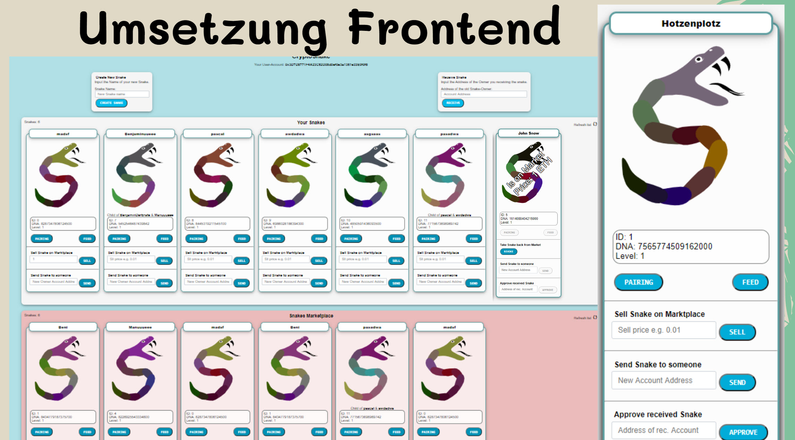
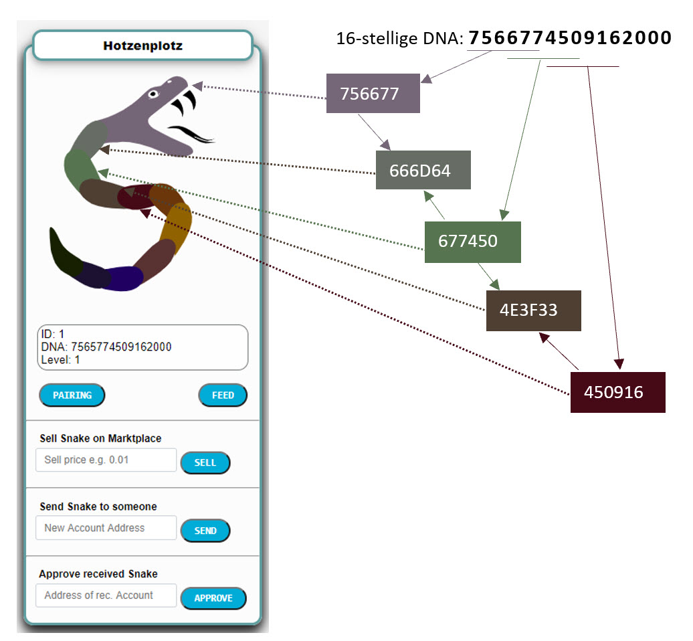
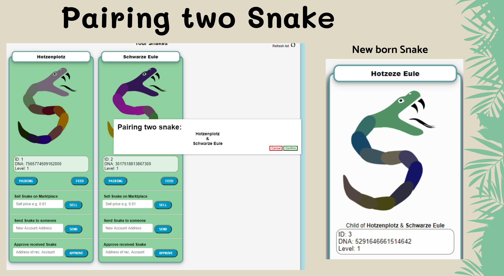

# Blockchain DApp: KryptoSnake

## Idee 
CryptoSnake ist eine Blockchain-Basierte Web-Applikation, mit welcher auf spielerische Art Schlangen gehalten, erzeugt, gefüttert und auf einem Markt gehandelt oder verschenkt werden können. Die WebApp wurde mit Smart-Contracts für die Ethereum-Blockchain entwickelt.

## Technologien
- Solidity
- JavaScript
- HTML
- CSS
- Blockchain
- Smart-Contracts
- Ethereum
- Remix

## Architektur 
Die Webapplikation ist unterteilt in ein klassisches Frontend und Backend. Das Frontend wurde mit den klassischen Webtechnologien wie JavaScript, HTML, CSS entwickelt. Im Backend wurde Solidity verwendet, um Smart Contracts zu erstellen, die dann auf der Ethereum Blockchain deployed werden. Um das Backend mit dem Frontend zu verbinden wurde Web3.js benutzt und zusätzlich noch MetaMask als Krypto-Wallet. Im Backend gibt es eine Vererbungsstruktur, um die einzelnen Smart Contracts besser aufzuteilen. Der Snake-Market ist als eigenständiger Contract deployed und ist somit nicht in der
Vererbungshierarchie.

## Das Spiel
### Eigenschaften einer Schlange (CryptoSnake) 
Jede Schlange besitzt folgende Attribute:
- Name: Der Name der Schlange 
- DNA: Eine DNA, die aus 16 Zahlen besteht (Aus der DNA lassen sich weitere Eigenschaften ablesen)
  Level: Zeigt die Entwicklung der Schlange an. Je höher der Level umso höher der Wert der Schlange
- Ready-Time: Gibt einen Zeitpunkt an, wann die Schlange wieder zur Paarung bereit ist. 

### Spielregeln
#### Schlange erzeugen 

##### Erzeugen durch Generieren 
Eine initiale Schlange kann pro User gratis erzeugt werden. Weitere Schlangen können jederzeit gegen 0.001 Ether erworben werden. Die letzten beiden Zahlen der DNA einer erzeugten Schlange sind 00. Somit ist anhand der DNA ersichtlich, ob diese Schlange erzeugt wurde.

##### Erzeugen durch Paaren 
Benutzer, welche über zwei Schlangen verfügen, können diese miteinander paaren, worauf eine neue Schlange entsteht. Die Schlange ist anschliessend ebenfalls im Besitz des Benutzers. Eine Schlange kann sich dabei allerdings höchstens alle 24h (beachte readyTime) einmal paaren. So ist es also nicht möglich, eine beliebige Anzahl Schlangen zu erzeugen. Die Eltern einer neu erzeugten Schlange werden zudem vermerkt, sodass sie zurückverfolgt werden kann. Die DNA der Schlange, welche durch Paarung entstanden ist, endet auf die Zahl 42. Somit kann anhand der DNA unterschieden werden ob diese Schlange durch Paarung oder durch einen Kauf entstanden ist.

#### Schlangen füttern
Schlangen können gefüttert werden, um so ein höheres Level zu erreichen. Das benötigte Futter kann gegen Ether gekauft werden. Beim Futterkauf gibt der Benutzer eine geheime Zutat (als Text) mit. Anhand dieser Zutat wird dann mathematisch berechnet wie viele Level aufgestiegen werden können und welchen Namen das Futter bekommt. Der Level-Upgrade Bereich liegt zwischen 1 und 5. Für den Namen des Futters gibt es auch 5 Möglichkeiten (Insects, Snails, Birds, Snakes, Deer). Nach dem Kauf von Schlangen-Futter, kann dies einer beliebigen Schlange zum Essen (feeding)
gegeben werden.

#### Schlangen-Marktplatz
Auf dem Marktplatz können die User ihre Schlangen verkaufen oder Schlangen von anderen Benutzern erwerben. Der gewünschte Verkaufspreis einer Schlange kann dabei selbst definiert werden. Nebst dem Kauf und Verkauf von Schlagen zu einem bestimmten Preis gibt es auch die Möglichkeit, eine Schlange
an jemanden zu verschenken.

#### Anreize für das Spiel 
Durch das Sammeln und Weiterentwickeln der Schlange kann ein höherer Preis am Markt verlangt werden. Ein weiterer Anreiz ist der Besitz einer einzigartigen Schlange, die dem Benutzer farblich oder
anhand der Eigenschaften besonders gefällt.

## Projekt-Team
Manuel Riedi, Benjamin Brodwolf, Pascal Andermatt

